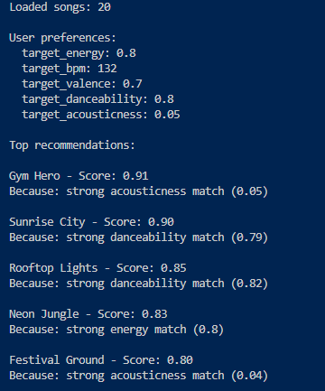
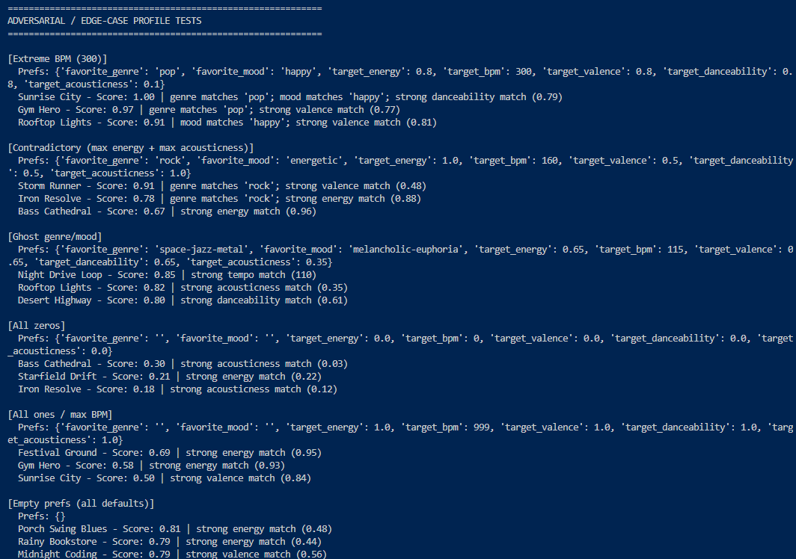
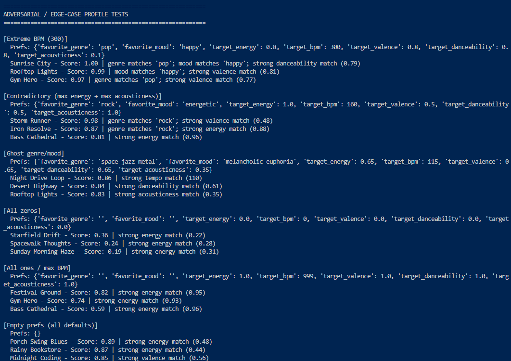
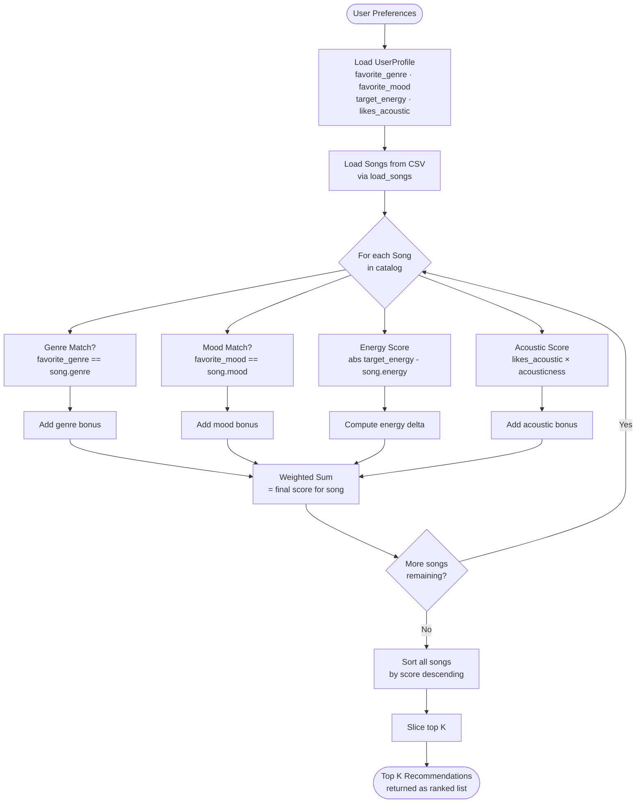

# 🎵 VibeCheck - Music Recommender

## Project Summary

In this project, a user provides input for a song they want to listen to. The application parses this query into a request to the Spotify API and returns 5 top ranked songs based on this query. Gemini provides a thoughtful reasoning for each song returned. This application allows users to find quick picks based on their mood, because sometimes searching through endless playlists is just too much.

---

## How The System Works

VibeCheck uses a four-step RAG (Retrieval-Augmented Generation) pipeline:

1. **Query parsing (Gemini)** — The user's natural language input (e.g. _"chill lo-fi for late night studying"_) is sent to Gemini, which converts it into a structured preference profile: target values for energy, valence, danceability, acousticness, and tempo, plus a genre and mood label.

2. **Track retrieval (Spotify)** — The parsed genre seeds are used to search the Spotify catalog for real candidate tracks. Audio features are requested from Spotify's `/audio-features` endpoint; if that is unavailable, per-track values are estimated by adding random variation around the user's targets so that each candidate is still distinct.

3. **Gaussian scoring (recommender)** — Every candidate track is scored against the user's preferences using a Gaussian similarity function: `score = e^(-(diff² / 2σ²))`, where `diff` is the absolute difference between the user's target and the song's value for each feature, and `σ = 0.2` is the tolerance. Features are weighted (energy 60%, valence 15%, danceability 12%, acousticness 8%, tempo 5%), with flat bonuses added for genre (+0.15) and mood (+0.10) matches. The top 5 songs are selected.

4. **Explanation generation (Gemini)** — The top 5 ranked songs are passed back to Gemini, which writes a short personalized explanation for each one grounded in the user's original query and the song's audio features.

---

## Architecture Overview


The design of the application is split into 5 essential levels:

- UI (Streamlit app)
- LLM (Google Gemini API, model `gemma-3-1b-it`)
- Music Catalog (Spotify Web API and local `data/songs.csv` as a fallback)
- Scoring (Pure Python using Gaussian similarity)
- Config (the local environment setup required to wire everything together)

---

## Getting Started

### Setup

1. Create a virtual environment (optional but recommended):

   ```bash
   python -m venv .venv
   source .venv/bin/activate      # Mac or Linux
   .venv\Scripts\activate         # Windows
   ```

2. Install dependencies

```bash
pip install -r requirements.txt
```

3. Create a .env in the root folder using .env.example as a guide

4. Sign up at developer.spotify.com, and create an App with the following settings:

```
App Name: VibeCheck
App description: Music recommender system.
Redirect URIs: https://example.org/callback
Which API/SDKs are you planning to use?: Web API
```

5. Add your Client ID and Client Secret to your .env file

6. Sign up for an API key at aistudio.google.com and add the key to your .env file

7. Run the app:

```bash
streamlit run src/app.py
```

### Example inputs

- "chill lo-fi for late night studying"

```
#1 Gravitation - Original Mix — Gennadiy Adamenko
#2 Feel so Good - Florito
#3 Love to Scat - Gary B
#4 Nemo - Ingo Herrmann
#5 Beat It - James Long
```

- "upbeat pop for a morning workout"

```
#1 So Easy (To Fall in Love) - Olivia Dean
#2 End of Beginning - Djo
#3 American Girls - Harry Styles
#4 E85 - Don Toliver
#5 Stateside + Zara Larsson - PinkPantheress
```

- "something moody and acoustic for a rainy day"

```
#1 Everybody Hurts - Thom Cooper
#2 Grenade - Karizma Duo
#3 New Heights - Denis Turbide
#4 Raining - Ai Mougi
# 5 Nothin Breaks Like a Heart - Landa
```

---

## Design Decisions

The system is built using simple scoring and an LLM's interpretation in two different areas of the application. This is done to allow retrieval from the Spotify API, and generation of the explanation for why the song was ranked in the top 5 based on the user's prompt. Only 5 songs are chosen as Spotify's API is particularly limiting with the number of songs it can return. The original plan was to have a "chatbot" like feel where the application can help a user deduce down a mood for a list of songs that fit that mood, but this was scrapped once I had found out just how little usage one can use with free tiers of the API keys. Instead, it was developed into a simple query processing system that parses a user's input into a mathematical representation, sent as a seed to Spotify's API and returns a list of top scoring songs based on the 1 LLM interpretation of the query. The results are returned with another AI generated explanation for why the song matched the query passed in.

---

## Limitations and Risks

Summarize some limitations of your recommender.

Examples:

- It only works on a tiny catalog
- It does not understand lyrics or language
- It might over favor one genre or mood

You will go deeper on this in your model card.

---

## Reflection

Read and complete `model_card.md`:

[**Model Card**](model_card.md)

Write 1 to 2 paragraphs here about what you learned:

- about how recommenders turn data into predictions
- about where bias or unfairness could show up in systems like this

---







## 7. `model_card_template.md`

Combines reflection and model card framing from the Module 3 guidance. :contentReference[oaicite:2]{index=2}

markdown

# 🎧 Model Card - Music Recommender Simulation

## 1. Model Name

Give your recommender a name, for example:

> VibeFinder 1.0

---

## 2. Intended Use

- What is this system trying to do
- Who is it for

Example:

> This model suggests 3 to 5 songs from a small catalog based on a user's preferred genre, mood, and energy level. It is for classroom exploration only, not for real users.

---

## 3. How It Works (Short Explanation)

Describe your scoring logic in plain language.

- What features of each song does it consider
- What information about the user does it use
- How does it turn those into a number

Try to avoid code in this section, treat it like an explanation to a non programmer.



---

## 4. Data

Describe your dataset.

- How many songs are in `data/songs.csv`
- Did you add or remove any songs
- What kinds of genres or moods are represented
- Whose taste does this data mostly reflect

---

## 5. Strengths

Where does your recommender work well

You can think about:

- Situations where the top results "felt right"
- Particular user profiles it served well
- Simplicity or transparency benefits

---

## 6. Limitations and Bias

Where does your recommender struggle

Some prompts:

- Does it ignore some genres or moods
- Does it treat all users as if they have the same taste shape
- Is it biased toward high energy or one genre by default
- How could this be unfair if used in a real product

---

## 7. Evaluation

How did you check your system

Examples:

- You tried multiple user profiles and wrote down whether the results matched your expectations
- You compared your simulation to what a real app like Spotify or YouTube tends to recommend
- You wrote tests for your scoring logic

You do not need a numeric metric, but if you used one, explain what it measures.

---

## 8. Future Work

If you had more time, how would you improve this recommender

Examples:

- Add support for multiple users and "group vibe" recommendations
- Balance diversity of songs instead of always picking the closest match
- Use more features, like tempo ranges or lyric themes

---

## 9. Personal Reflection

A few sentences about what you learned:

- What surprised you about how your system behaved
- How did building this change how you think about real music recommenders
- Where do you think human judgment still matters, even if the model seems "smart"

# TF Submission: Justin Dingeman

1. The core concept students needed to understand.

- Students should understand what recommender systems are and how they use mathematical calculations to come up with recommendations based on user data. They should understand how to use the AI chatbot with and without context and how to isolate its work in small chunks.

2. Where students are most likely to struggle

- The instructions are confusing, particularly in Phase 2. The student would have already described their scoring method in the README.md, but this section goes on further to have the student open a new chat session, and ask Copilot to come up with another scoring system based on the data. This can cause unnecessary confusion because the student will be questioning which of the two chatbot sessions they should be going with, especially since the new chat session no longer has the context that was discussed in the previous session. The flow of steps is also confusing, and seems to imply a very rigid structure needed for development.
- Phase 3, Step 2: Instructions says to look for `score_song(user_prefs, song)`, but there is no such function in the provided repo. Instructions also say to prompt the AI based on the "algorithm recipe" from Phase 2 but this is vague because there is no solid place/understanding of what constitutes the "algorithm recipe". Is it the flowchart? The description? Just the scoring method?

3. Where AI was helpful vs. misleading

- The AI is helpful with data creation and complex data. It wasn't so much misleading as it more had too much agency within the application, at least given the instructions.

4. One way they would guide a student without giving the answer

- I'd ask them what they understand before they try to tackle the larger problems. That way, I can have them talk through the beginning steps up to the point that they get lost to see if retracing their steps helps lead them in a more concrete direction.
